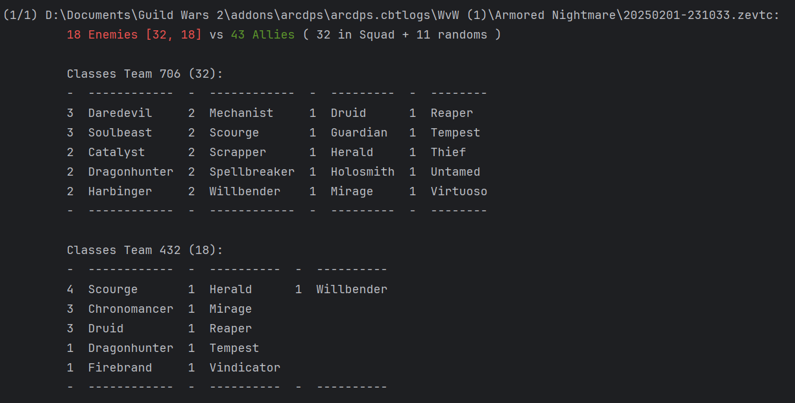

# KnowPyEnemy
KnowPyEnemy - Python based extension processing ArcDps logs to show information about enemy numbers

## Requirements/Setup

- Windows 10/11
- Install [Python 3.12](https://www.python.org/downloads/) or compatible version
- Install [.NET 8 runtime](https://aka.ms/dotnet-core-applaunch?missing_runtime=true&arch=x64&rid=win-x64&os=win10&apphost_version=8.0.12)
- [Download repository](https://github.com/armorednightmare/KnowPyEnemy/archive/refs/heads/main.zip)
- Install required packages mentioned in requirement.txt
  - a virtual environment is recommended, e.g. check guide [here](https://www.freecodecamp.org/news/how-to-setup-virtual-environments-in-python/)
  - Run Terminal & run `py -m pip install -r requirements.txt`
- In Terminal run Setup.py
  - set the path to your ARCDPS log directory when the selector pops up
    - usually this is `%USERPROFILE%\Documents\Guild Wars 2\addons\arcdps\arcdps.cbtlogs`
 
### Service/Observer
While playing in WvW, this will show you the details just after each encounter. 
Keep in mind, processing large log files might take a while to complete. 

- In Terminal: run python KnowPyEnemy_service.py

### Script processing
In the case you forgot to run the service and still want to know the details for the last few encounters:

- In Terminal: run KnowPyEnemy.py 

## Example

Copyright - All rights reserved @armorednightmare
